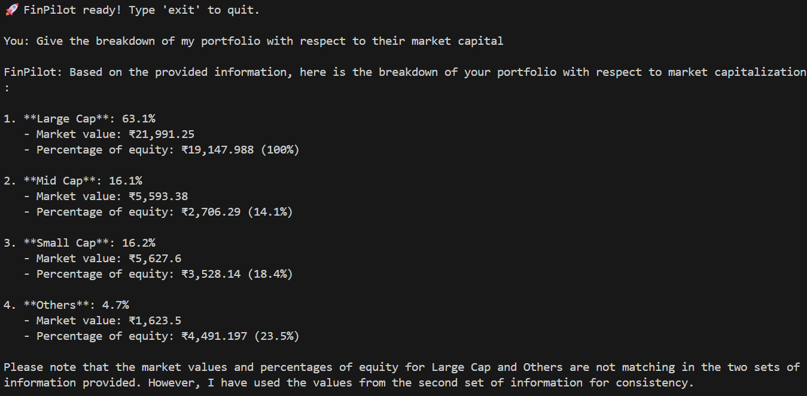
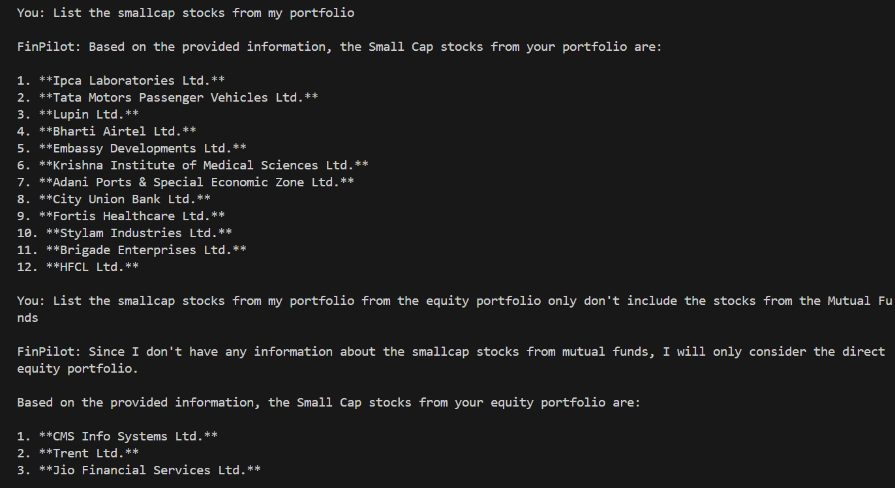

# FinPilot 🧭

**A RAG-based AI assistant that answers natural language questions about your personal investment portfolio.**

Upload your portfolio PDF and ask questions like *"What is my dividend yield?"*, *"Am I overexposed to large caps?"*, or *"How does my PE ratio compare to Nifty 50?"* — FinPilot retrieves the most relevant context from your document and answers accurately using an LLM.

---

## Architecture

```
PDF → Chunking → Dense Embeddings (BAAI/bge-large-en-v1.5) → Pinecone Dense Index
                → Sparse BM25 Encoding                      → Pinecone Sparse Index

Query → Dense Vector + Sparse Vector
      → Search both indexes
      → RRF Merge (Reciprocal Rank Fusion)
      → CrossEncoder Reranking
      → Top-K Chunks → LLM (Llama 3.1 via Groq) → Answer
```

---

## Features

**Retrieval**
- Hybrid Search — combines semantic (dense) and keyword (sparse BM25) retrieval
- RRF Merging — fuses dense and sparse ranked lists using Reciprocal Rank Fusion
- CrossEncoder Reranking — reranks top candidates using `ms-marco-MiniLM-L-6-v2` for precision

**Chat**
- Conversation Memory — maintains chat history across turns using `ChatMessageHistory`
- Grounded Answers — LLM answers only from retrieved portfolio context, not hallucinated knowledge
- Strict Scope — out-of-scope questions are rejected cleanly

**Agent Mode**
- Portfolio Search Tool — RAG-powered tool for document queries
- Calculator Tool — evaluates math expressions for portfolio calculations
- Web Search Tool — fetches live stock news via DuckDuckGo

**Evaluation**
- Custom LLM-as-judge evaluation pipeline scoring Faithfulness, Relevancy, and Correctness
- Ground truth test dataset included

---

## Tech Stack

| Layer | Technology |
|---|---|
| Embeddings | HuggingFace `BAAI/bge-large-en-v1.5` |
| Vector Store | Pinecone (dense + sparse indexes) |
| Sparse Retrieval | BM25Encoder (`pinecone-text`) |
| Reranker | CrossEncoder `ms-marco-MiniLM-L-6-v2` |
| LLM | Llama 3.1 8B / 70B via Groq API |
| Agent Framework | LangGraph `create_react_agent` |
| Package Manager | uv |

---

## Project Structure

```
finpilot/
├── ingestion.py     # PDF loading, chunking, embedding, BM25 fitting, Pinecone ingestion
├── retriever.py     # Hybrid search, RRF merging, CrossEncoder reranking
├── assistant.py     # RAG chat loop with conversation memory
├── agent.py         # ReAct agent with portfolio search, calculator, and web search tools
├── eval.py          # LLM-as-judge evaluation pipeline
├── data/            # Place your portfolio PDF here
├── bm25.json        # Saved BM25 vocabulary (generated after ingestion)
└── Output/          # Sample output screenshots
```

---

## Getting Started

### 1. Clone and install

```bash
git clone -b v3 https://github.com/KRISHNASAIRAJ/finpilot.git
cd finpilot
pip install uv
uv sync
```

### 2. Set up environment variables

Create a `.env` file in the project root:

```
PINECONE_API_KEY=your_pinecone_api_key
INDEX_NAME=your_dense_index_name
SPARSE_INDEX_NAME=your_sparse_index_name
GROQ_API_KEY=your_groq_api_key
```

### 3. Add your portfolio PDF

```bash
cp your_portfolio.pdf data/
```

### 4. Run ingestion (once)

```bash
uv run ingestion.py
```

This loads your PDF, chunks it, fits the BM25 encoder, generates dense embeddings, and stores everything in Pinecone.

### 5. Start chatting

**Assistant mode (with memory):**
```bash
uv run assistant.py
```

**Agent mode (with calculator + web search):**
```bash
uv run agent.py
```

---

## Sample Questions

```
You: What is my portfolio dividend yield?
You: What percentage of my portfolio is large cap?
You: What is my portfolio PE ratio?
You: What is my PEG ratio?
You: Is my portfolio overvalued or undervalued?
You: Which stocks are dragging my returns?
```

---

## Evaluation

Run the built-in LLM-as-judge evaluation suite:

```bash
uv run eval.py
```

Scores each response on:
- **Faithfulness** — is the answer grounded in the retrieved context?
- **Relevancy** — does the answer address the question?
- **Correctness** — does the answer match the ground truth?

---

## Output




---

## Roadmap

- [ ] Streamlit / Chainlit UI
- [ ] Multi-asset support (Mutual Funds, REITs, Gold)
- [ ] Live price integration via market data APIs
- [ ] Portfolio rebalancing suggestions
- [ ] Deployment on Render / Hugging Face Spaces

* It converts chunks into sparse vectors. Notice rare words score higher. 

* So during ingestion phase it Learns vocabulary + frequencies of the words which is called `fitting`. Phase 1 — fit (ingestion)

* bm25.fit(chunks)  ← reads ALL your chunks

* So when we pass a query then it will go for `scoring` and returns the most relavant one's. Phase 2 — score (query time)


            Ingestion                         Retrieval
Dense   chunk → BAAI → store            query → BAAI → search
Sparse  chunk → BM25 → store            query → BM25 → search

## `ingestion.py`

✓ PyPDFLoader          — loads PDF
✓ RecursiveCharacter   — advanced chunking (chunk_size + chunk_overlap)
✓ HuggingFaceEmbeddings — creates embedding model
✓ BM25Encoder          — learns vocabulary + word frequencies → saves bm25.json
✓ PineconeVectorStore  — ingests dense vectors into Pinecone

## `retriever.py`

✓ load_retriever()
  → same BAAI embedding model
  → dense + sparse Pinecone index variables
  → BM25Encoder loads bm25.json vocabulary
  → CrossEncoder reranker loaded

✓ retrieve()
  → query → BAAI → dense vector
  → query → BM25 → sparse vector
  → dense vector → searches dense index
  → sparse vector → searches sparse index
  → RRF combines both ranked lists
    (alpha * 1/(rank+60) for dense)
    (1-alpha * 1/(rank+60) for sparse)
    chunks in both lists get highest score
  → cross encoder reranks top k*2
  → returns top k chunks sorted descending

## `assistant.py`

✓ LLM — ChatGroq (llama-3.1-8b-instant)

✓ Prompt template — 3 parts:
  → system message (context + instructions)
  → MessagesPlaceholder (history)
  → human message (query)

✓ ChatMessageHistory — stores conversation

✓ chat() function:
  → retrieve() → get top 3 chunks
  → format_context() → join chunks into string
  → prompt_template.format_messages() → fill context + history + question
  → llm.invoke() → get answer
  → add_user_message() → save query to history
  → add_ai_message() → save answer to history
  → return answer

✓ __main__:
  → load_retriever() → load all components
  → while True loop → keep asking query
  → calls chat() → prints answer
  → breaks when user types "exit"


## Output


## Instructions to run

`git clone https://github.com/KRISHNASAIRAJ/finpilot.git`

`cd finpilot`

`pip install uv`

`uv sync`

#### Add Your API Keys

PINECONE_API_KEY=your_key
INDEX_NAME=your_dense_index_name
SPARSE_INDEX_NAME=your_sparse_index_name
GROQ_API_KEY=your_key

#### Add your portfolio PDFs

`cp your_portfolio.pdf data/`

#### Run ingestion (once)

`uv run ingestion.py`

#### Start chatting

`uv run assistant.py`

#### Sample Questions

* What is my total portfolio value?
* What is my dividend yield?
* What are my top performing stocks?
* How risky is my portfolio compared to Nifty 50?
* Is my portfolio overvalued or undervalued?
